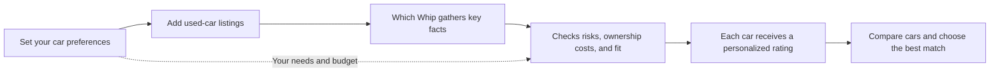

# How Which Whip Works

```mermaid
flowchart LR
    A[Set your car preferences] --> B[Add used-car listings]
    B --> C[Which Whip gathers key facts]
    C --> D[Checks risks, ownership costs, and fit]
    D --> E[Each car receives a personalized rating]
    E --> F[Compare cars and choose the best match]

    A -. Your needs and budget .-> D
```

Which Whip turns raw listings into a buyer-specific shortlist:

**Preferences + listings → research and evaluation → ratings and comparison**
